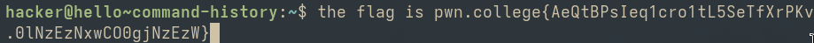

# Command History
### In this challange user scrolls through commands by using up/down arrow keys.

### flag
pwn.college{AeQtBPsIeq1cro1tL5SeTfXrPKv.0lNzEzNxwCO0gjNzEzW}

### How I did
I used the up/down arrow keys and up arrow key displayed the flag (which was supposed to be a command).

### What I learnt
I learnt that using up/down arrow keys can fetch me the commands I used previously.
