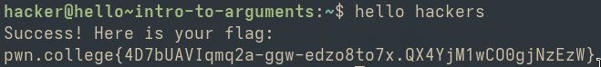

# Intro to Argumetns
### In this challenge user must run hello command with a single argument of hackers.

### Flag
pwn.college{4D7bUAVIqmq2a-ggw-edzo8to7x.QX4YjM1wCO0gjNzEzW}

### How I did
I typed in the command "hello" first and then entered the argument "hackers" to obtain the flag.

### What I learnt
I learnt about arguments and how they are used in the terminal and that arguments too are case sensitive.
