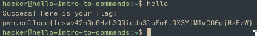
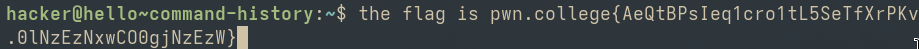

# Intro to Commands
* ### In the challenge the user invokes their first command i.e "hello".

* ###  Flag
pwn.college{Ieswv42nQuGHzh3QQicda3luFuf.QX3YjM1wCO0gjNzEzW}

* ### How I solved
I solved the given challange by typing in "hello" in the terminal, which then invoked the command and displayed the flag.

* ### what I learnt
I learnt how to invoke a command and that Linux terminal is case sensitive as only "hello" worked not "HELLO".

# Intro to Argumetns
* ### In this challenge user must run hello command with a single argument of hackers.

* ### Flag
pwn.college{4D7bUAVIqmq2a-ggw-edzo8to7x.QX4YjM1wCO0gjNzEzW}

* ### How I did
I typed in the command "hello" first and then entered the argument "hackers" to obtain the flag.

* ### What I learnt
I learnt about arguments and how they are used in the terminal and that arguments too are case sensitive.

# Command History
* ### In this challange user scrolls through commands by using up/down arrow keys.

* ### flag
pwn.college{AeQtBPsIeq1cro1tL5SeTfXrPKv.0lNzEzNxwCO0gjNzEzW}

* ### How I did
I used the up/down arrow keys and up arrow key displayed the flag (which was supposed to be a command).

* ### What I learnt
I learnt that using up/down arrow keys can fetch me the commands I used previously.
